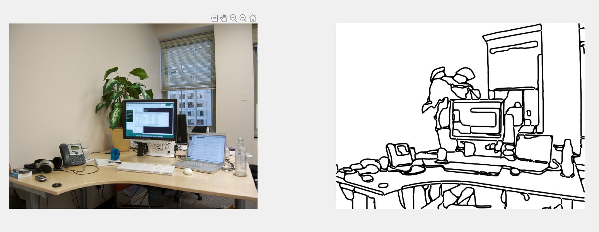

# DollarLineDrawing

 

## Setup

**NOTE** 

THIS CODE IS TESTED WITH MATLAB 2018b (Signal Processing Toolbox is needed!)

To download the code, open a terminal and type:
```
https://github.com/mrezanejad/DollarLineDrawing.git
```
This will create a directory `DollarLineDrawing/` containing all of the code seen here.
<br>
This package uses Structured Edge Detection Toolbox (https://github.com/pdollar/edges). 

## Usage

```
generate_lineDrawingFromRealImage('path/to/your/image')
```

## Example

```
generate_lineDrawingFromRealImage('office.jpg')
```

## Updating
Assuming you have not made any local changes to these files, you can update your local code to the newest version with [git pull](https://git-scm.com/docs/git-pull).
Open a terminal, navigate to your `SalienceScoresForScene/` folder, and run
```
git pull
```

If you have edited any files, `git pull` may throw errors. You can update while keeping your local changes by running:
```
git stash
git pull
git stash pop
```

If you are new to git, you can learn more about it [here](https://git-scm.com/doc)
<br>
<br>

## References
If you use the our SalienceScoresForScenes package, we appreciate it if you cite the following papers:

```
@InProceedings{rezanejad2019scene,
author = {Rezanejad, Morteza and Downs, Gabriel and Wilder, John and Walther, Dirk B and Jepson, Allan and Dickinson, Sven and Siddiqi, Kaleem},
title = {Scene Categorization from Contours: Medial Axis Based Salience Measures},
booktitle = {The IEEE Conference on Computer Vision and Pattern Recognition (CVPR)},
month = {June},
year = {2019}
}
@inproceedings{DollarICCV13edges,
  author    = {Piotr Doll\'ar and C. Lawrence Zitnick},
  title     = {Structured Forests for Fast Edge Detection},
  booktitle = {ICCV},
  year      = {2013},
}
```

## Contact
For any question regarding this package, please contact morteza@cim.mcgill.ca

## License
This program is free software: you can redistribute it and/or modify
it under the terms of the GNU General Public License as published by
the Free Software Foundation, either version 3 of the License, or
(at your option) any later version.

This program is distributed in the hope that it will be useful,
but WITHOUT ANY WARRANTY; without even the implied warranty of
MERCHANTABILITY or FITNESS FOR A PARTICULAR PURPOSE.  See the
GNU General Public License for more details.

You should have received a copy of the GNU General Public License
along with this program.  If not, see <https://www.gnu.org/licenses/>.
